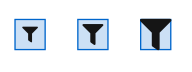
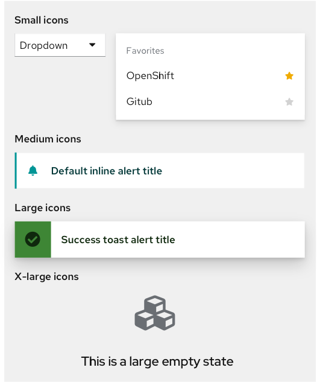

import { Button, Divider, Grid, GridItem } from '@patternfly/react-core';
import { CheckCircleIcon, TimesCircleIcon, FilterIcon } from '@patternfly/react-icons';
import { Icons } from 'gatsby-theme-patternfly-org/components/icons/icons';
import { IconRecommendations } from './IconRecommendations';
import { IconsTable } from './IconsTable';
import './icons.css';

<Divider className="ws-icons-divider" />

If you're a developer, <a href="/get-started/developers#using-styles">check out our getting started page</a> to learn more about how to get and use our icon set.

## Icon sizes
<Grid gutter="md">
  <GridItem xl={6} lg={12} className="ws-icons-gridtext">
    
Icons always live in a 24x24 box so they align with our text line height and have an accessible focus radius. This means that icons will take up a minimum of 24px space. This is especially clear within <a href="/design-guidelines/usage-and-behavior/buttons-and-links#link-button" className="pf-m-link">link buttons</a>.

    

      
    

    <Button variant="link" icon={<FilterIcon size="sm" />}></Button>
    <Button variant="link" icon={<FilterIcon size="md" />}></Button>
    <Button variant="link" icon={<FilterIcon size="lg" />}></Button>
    
Medium icons are used as our base size across our system as a whole and we recommend using this base size within your applications. Small, large and x-large icons are used sparingly across PatternFly components. Here is a full complete list of icon sizes:

    <Grid gutter="md">
      <GridItem sm={2}><FilterIcon size="sm" /></GridItem>
      <GridItem sm={10}>
        <Grid>
          <GridItem>Small (10px)</GridItem>
          <GridItem><code>-pf-global-icon-FonSize-sm</code></GridItem>
        </Grid>
      </GridItem>
      <GridItem sm={2}><FilterIcon size="md" /></GridItem>
      <GridItem sm={10}>
        <Grid>
          <GridItem>Medium (18px)</GridItem>
          <GridItem><code>-pf-global-icon-FonSize-md</code></GridItem>
        </Grid>
      </GridItem>
      <GridItem sm={2}><FilterIcon size="lg" /></GridItem>
      <GridItem sm={10}>
        <Grid>
          <GridItem>Large (24px)</GridItem>
          <GridItem><code>-pf-global-icon-FonSize-lg</code></GridItem>
        </Grid>
      </GridItem>
      <GridItem sm={2}><FilterIcon size="xl" /></GridItem>
      <GridItem sm={10}>
        <Grid>
          <GridItem>X-large (54px)</GridItem>
          <GridItem><code>-pf-global-icon-FonSize-xl</code></GridItem>
        </Grid>
      </GridItem>
    </Grid>
  </GridItem>
  <GridItem xl={6} lg={12}>
    
  </GridItem>
</Grid>

<Divider className="ws-icons-divider" />

## Icon colors

Visit our <a href="/design-guidelines/styles/colors" className="pf-m-link">colors page</a> to learn more about icon colors.

<Divider className="ws-icons-divider" />

## All icons

PatternFly uses custom icons and selections from [FontAwesome](https://fontawesome.com/icons). PatternFly icons are two dimensional and flat. Navigate to FontAwesome’s website to download SVGs of any ‘fa’ icons. Click on any single pf-icon in the table to download it as an SVG. Download all icon SVGs [here](#).

If you’re a designer, these icons are the same set as the ones in the [PatternFly Sketch Design Kit](https://www.patternfly.org/v4/get-started/designers). It is possible to use any FontAwesome icon as long it follows the guidelines above.

If you’re looking to copy HTML for an icon:

Use this for 'pficon' icons: <code>&lt;i className="pf-icon [insert-icon-name]"&gt;&lt;/i&gt;</code>

Use this for 'fa' solid icons: <code>&lt;i className="fas [insert-icon-name]"&gt;&lt;/i&gt;</code>

Use this for 'fa' regular icons: <code>&lt;i className="far [insert-icon-name]"&gt;&lt;/i&gt;</code>

<small>Note: Be sure to read <a href="/get-started/developers#using-styles" className="pf-m-link">how to get started with icons</a> when using 'fa' regular icons</small>

If you're looking to copy React for an icon:
Use this for 'pficon' icons: <code>import { [insert-icon-name] } from '@patternfly/react-icons'</code>

<!-- <Icons /> -->
<IconsTable />

<Divider className="ws-icons-divider" />

## Updated icon recommendations

We’ve recently updated some of our PatternFly icons as well as icon usage guidelines. If you are using an outdated icon, we suggest you migrate over to the newest recommendations.

<IconRecommendations />
